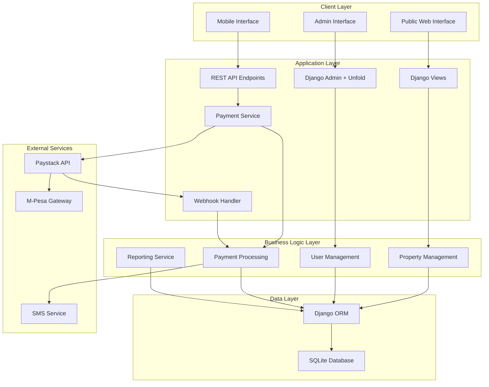
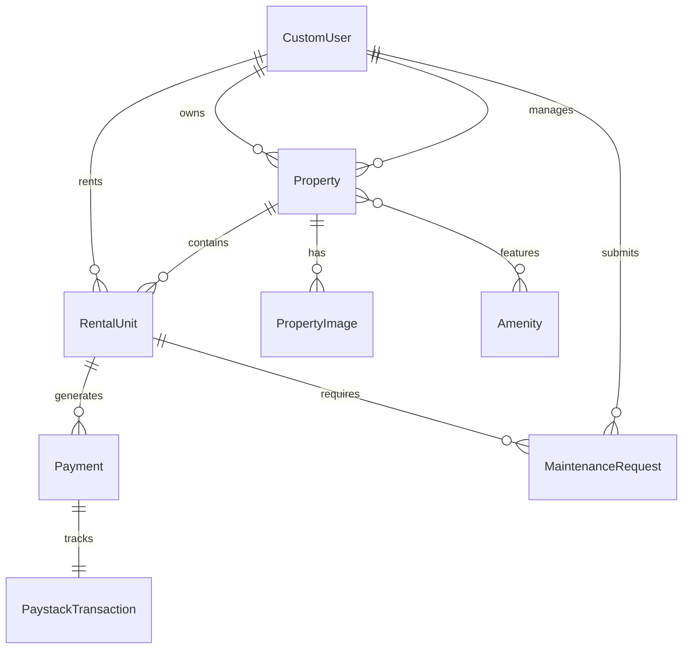

# Design Document

## Overview

The Rental Management System is a Django-based web application designed for the Kenyan rental market. It provides a comprehensive platform for property managers, landlords, and tenants with role-based access control, integrated payment processing via Paystack, and a modern, responsive user interface.

### Key Technologies
- **Backend**: Django 5.0+ (latest stable)
- **Database**: SQLite (development), PostgreSQL (production ready)
- **Frontend**: TailwindCSS v4 with shadcn design system principles
- **Admin Interface**: Django Unfold for enhanced admin experience
- **Payment Processing**: Paystack API with M-Pesa and card support
- **Authentication**: Django's built-in authentication with custom user roles

## Architecture

### System Architecture



### Application Structure
Use django commands to create the project structure and commands.
Do not use this structure as it is, use it as a guide/blueprint. 
```
rental_management/
│── properties/         # Property and unit management
│── users/              # Custom user model and roles
│── payments/           # Payment processing and webhooks
│── maintenance/        # Maintenance request management
│── reports/            # Reporting and analytics
├── core/               # Shared utilities and base classes
├── static/             # Static files (CSS, JS, images)
├── templates/          # Django templates
├── rental_management/  # Django settings and configuration
└── requirements.txt    # Python dependencies
```

## Components and Interfaces

### User Management Component

**Models:**
- `CustomUser`: Extends Django's AbstractUser with role field
- `UserProfile`: Additional user information and preferences
- `Role`: Enum for user roles (ADMIN, PROPERTY_MANAGER, LANDLORD, TENANT)

**Key Methods:**
```python
class CustomUser(AbstractUser):
    role = models.CharField(max_length=20, choices=Role.choices)
    phone_number = models.CharField(max_length=15)
    
    def has_property_access(self, property_id):
        """Check if user can access specific property"""
        pass
    
    def get_accessible_properties(self):
        """Return queryset of properties user can access"""
        pass
```

### Property Management Component

**Models:**
- `Property`: Main property information
- `RentalUnit`: Individual units within properties
- `PropertyImage`: Property photos and media
- `Amenity`: Available amenities and features

**Key Relationships:**
```python
class Property(models.Model):
    name = models.CharField(max_length=200)
    address = models.TextField()
    county = models.CharField(max_length=50)
    town = models.CharField(max_length=50)
    property_type = models.CharField(max_length=50)
    owner = models.ForeignKey(CustomUser, on_delete=models.CASCADE)
    manager = models.ForeignKey(CustomUser, related_name='managed_properties')
    
class RentalUnit(models.Model):
    property = models.ForeignKey(Property, on_delete=models.CASCADE)
    unit_number = models.CharField(max_length=20)
    rent_amount = models.DecimalField(max_digits=10, decimal_places=2)
    deposit_amount = models.DecimalField(max_digits=10, decimal_places=2)
    is_available = models.BooleanField(default=True)
    current_tenant = models.ForeignKey(CustomUser, null=True, blank=True)
```

### Payment Processing Component

**Models:**
- `Payment`: Payment records and status
- `PaymentMethod`: Supported payment methods
- `PaystackTransaction`: Paystack-specific transaction data
- `PaymentWebhook`: Webhook event logging

**Paystack Integration:**
```python
class PaystackService:
    def __init__(self):
        self.secret_key = settings.PAYSTACK_SECRET_KEY
        self.public_key = settings.PAYSTACK_PUBLIC_KEY
        
    def initialize_payment(self, amount, email, callback_url):
        """Initialize payment with Paystack"""
        pass
        
    def verify_payment(self, reference):
        """Verify payment status with Paystack"""
        pass
        
    def process_webhook(self, payload, signature):
        """Process and verify webhook from Paystack"""
        pass
```

**Webhook Handler:**
```python
@csrf_exempt
def paystack_webhook(request):
    """Handle Paystack webhook notifications"""
    signature = request.headers.get('X-Paystack-Signature')
    payload = request.body
    
    if not verify_webhook_signature(payload, signature):
        return HttpResponse(status=400)
    
    event_data = json.loads(payload)
    process_payment_event(event_data)
    return HttpResponse(status=200)
```

### Maintenance Management Component

**Models:**
- `MaintenanceRequest`: Maintenance issues and requests
- `MaintenanceCategory`: Types of maintenance issues
- `MaintenanceUpdate`: Status updates and progress tracking

## Data Models

### Core Entity Relationships



### Database Schema Highlights

**Properties Table:**
- Indexed on county, town, property_type for efficient filtering
- Full-text search on name and address
- Soft delete implementation for data retention

**Payments Table:**
- Compound index on tenant_id and payment_date
- Status field with choices (PENDING, COMPLETED, FAILED, REFUNDED)
- Integration with Paystack reference numbers

**Users Table:**
- Role-based permissions using Django groups
- Phone number validation for Kenyan formats (+254...)
- Email verification for account activation

## Error Handling

### Payment Error Handling

**Paystack API Errors:**
- Network timeouts: Retry with exponential backoff (3 attempts)
- Invalid API keys: Log error and notify administrators
- Insufficient funds: Display user-friendly message with alternative payment methods
- Webhook signature mismatch: Log security incident and reject payload

**M-Pesa Specific Errors:**
- Invalid phone number format: Client-side validation with Kenyan number patterns
- Transaction timeout: Provide status check mechanism
- Insufficient balance: Clear error message with retry option

### Application Error Handling

**Database Errors:**
- Connection failures: Graceful degradation with cached data where possible
- Constraint violations: User-friendly validation messages
- Migration errors: Automated rollback procedures

**Authentication Errors:**
- Invalid credentials: Rate limiting after multiple failed attempts
- Session expiry: Automatic redirect to login with return URL
- Permission denied: Clear messaging about required access levels

## Testing Strategy

### Unit Testing
- **Models**: Test all model methods, validations, and relationships
- **Services**: Mock external API calls (Paystack) for isolated testing
- **Utilities**: Test helper functions and custom validators
- **Coverage Target**: 90%+ code coverage

### Integration Testing
- **Payment Flow**: End-to-end payment processing with Paystack sandbox
- **Webhook Processing**: Test webhook signature verification and event handling
- **User Permissions**: Test role-based access control across all views
- **API Endpoints**: Test all REST API endpoints with various user roles

### Performance Testing
- **Database Queries**: Optimize N+1 queries using select_related/prefetch_related
- **Page Load Times**: Target <2 seconds for property listing pages
- **Concurrent Users**: Test system with 100+ concurrent users
- **Payment Processing**: Test payment throughput and error recovery

### Security Testing
- **Authentication**: Test session management and password policies
- **Authorization**: Verify role-based access controls
- **Input Validation**: Test for SQL injection, XSS, and CSRF vulnerabilities
- **Payment Security**: Verify PCI DSS compliance and secure data handling

### Frontend Testing
- **Responsive Design**: Test across mobile, tablet, and desktop viewports
- **Cross-browser**: Test on Chrome, Firefox, Safari, and mobile browsers
- **Accessibility**: WCAG 2.1 AA compliance testing
- **TailwindCSS**: Verify consistent styling across all components

### Deployment Testing
- **Environment Parity**: Test development, staging, and production configurations
- **Database Migrations**: Test forward and backward migration compatibility
- **Static Files**: Verify CSS/JS compilation and CDN integration
- **Environment Variables**: Test configuration management and secrets handling

## Implementation Considerations

### Kenyan Market Specifics
- **Currency**: All amounts in KES with proper formatting (KES 1,000.00)
- **Phone Numbers**: Validation for Kenyan formats (+254 or 07xx)
- **Locations**: Pre-populated county and town data for Kenya
- **Payment Preferences**: M-Pesa as primary, cards as secondary option

### Scalability Considerations
- **Database**: Ready for PostgreSQL migration when needed
- **Caching**: Redis integration points identified for future implementation
- **File Storage**: Django storage backend ready for cloud storage migration
- **API Rate Limiting**: Prepared for high-volume payment processing

### Security Measures
- **Environment Variables**: All sensitive data in environment variables
- **HTTPS**: SSL/TLS enforcement in production
- **CSRF Protection**: Django CSRF middleware enabled
- **SQL Injection**: Django ORM prevents SQL injection by default
- **XSS Protection**: Template auto-escaping enabled